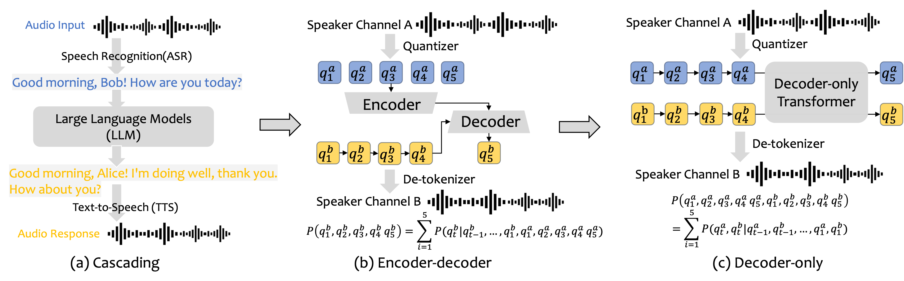
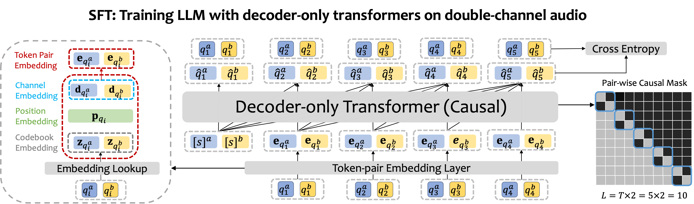

# Improving Conversational Capabilities of Speech Language Models via Generative Dual-channel Spoken Dialogue Learning


<!--  -->


<!-- <embed src="assert/audio-introduction.pdf" width="600" height="500" type="application/pdf"> -->

Key features:
- Pre-training: Transform single-channel audio into discrete tokens for next-token prediction
- SFT: Novel "next-token-pair prediction" objective for natural conversation comprehension
- Result: More natural and fluid spoken interactions compared to baseline approaches



## Installation

```bash
git clone https://github.com/anonymous/parrot.git
cd parrot
python -m venv venv
source venv/bin/activate  # On Windows, use `venv\Scripts\activate`
pip install -r requirements.txt
```

## Usage

1. Prepare audio data for pre-training and fine-tuning
2. Pre-train: `python pretrain.py --input_data path/to/single_channel_data`
3. Fine-tune: `python finetune.py --input_data path/to/double_channel_data`
4. Inference: `python inference.py --input_audio path/to/input.wav`

For detailed instructions, see the `docs` folder.

## Project Structure

```
parrot/
├── data/
│   ├── single_channel/
│   └── double_channel/
├── models/
│   ├── dual_llama.py
│   └── dual_phi.py
├── utils/
│   ├── audio_processing.py
│   └── tokenization.py
├── scripts/
│   ├── pretrain.py
│   ├── finetune.py
│   └── inference.py
├── docs/
│   └── usage_guide.md
├── tests/
│   └── test_models.py
├── requirements.txt
├── setup.py
└── README.md
```


## License

This project is licensed under the MIT License. See the [LICENSE](LICENSE) file for details.
